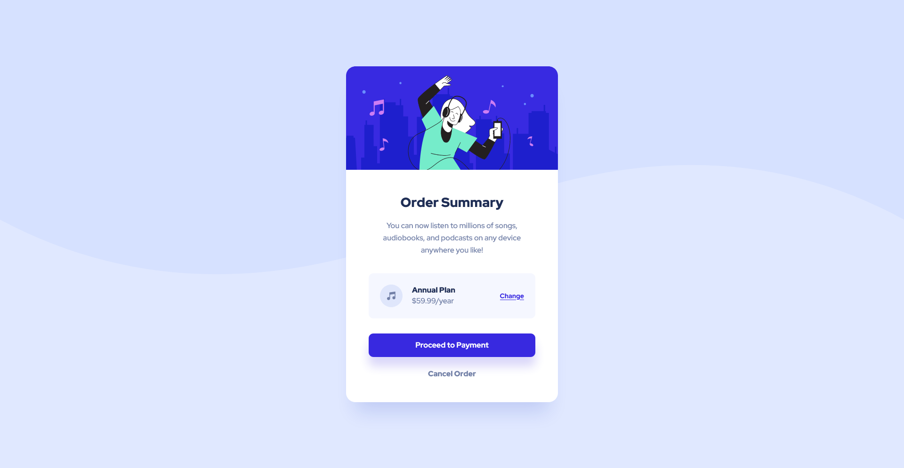
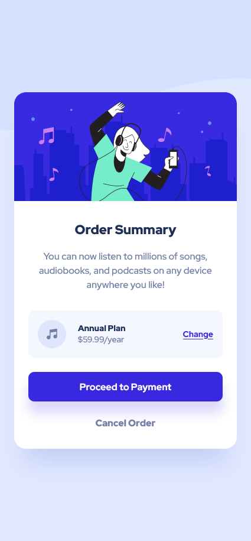

# Frontend Mentor - Order summary card solution

This is a solution to the [Order summary card challenge on Frontend Mentor](https://www.frontendmentor.io/challenges/order-summary-component-QlPmajDUj). Frontend Mentor challenges help you improve your coding skills by building realistic projects. 

## Table of contents

- [Overview](#overview)
  - [The challenge](#the-challenge)
  - [Screenshot](#screenshot)
  - [Links](#links)
- [My process](#my-process)
  - [Built with](#built-with)
  - [What I learned](#what-i-learned)
  - [Continued development](#continued-development)
  - [Useful resources](#useful-resources)
- [Author](#author)

## Overview

### The challenge

Users should be able to:

- See hover states for interactive elements

### Screenshot

### Links

- Solution URL: [https://github.com/Lairdfire/order-summary-component-main](https://github.com/Lairdfire/order-summary-component-main)
- Live Site URL: [https://lairdfire.github.io/order-summary-component-main/](https://lairdfire.github.io/order-summary-component-main/)

## My process

### Built with

- HTML5
- CSS3
- Flexbox
- Mobile-first workflow

### What I learned

- Finally learned to do some responsive design, which I'm very proud of.
- Learned to use media queries.
- Designing mobile first.

### Continued development

I will continue doing the front-end mentor challenges using this workflow.

### Useful resources

- [Taking on a Frontend Mentor challenge by Kevin Powell](https://www.youtube.com/watch?v=B2WL6KkqhLQ&t=1707s) - This content creator is, in my opinion, one of the best Front-end teacher out there, learned a lot from him and mostly his code along videos.

## Author

- Github - [Lairdfire](https://github.com/Lairdfire)
- Frontend Mentor - [@lairdfire](https://www.frontendmentor.io/profile/Lairdfire)
